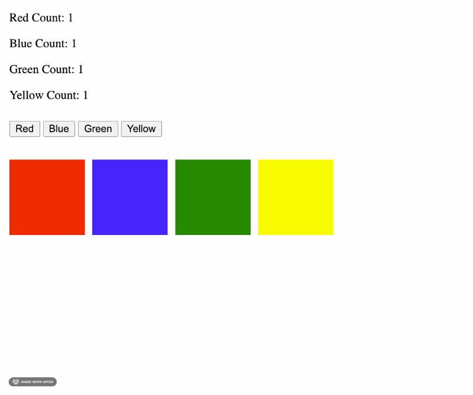

# Color Blocks 🟥 🟦 🟩 🟨 Solo Challenge

## 🔥 Important Notes 🔥

* This is a **two-part** assignment! Do not attempt Part Two until you have completed Part One!
* You will need to

## Assignment Objectives

We are building an application that creates color blocks on the DOM, based on button clicks. When a user clicks on a color button, it will create a color block of that color. When a user clicks on a given color block, it will be deleted from the DOM.

- Practice Read and Write skills
- Solidify jQuery knowledge
  - Selectors
  - Dynamic Content
  - Methods `.on()`, `.append()`, `remove()`

## Required Functionality for Part One!

You are provided with 4 buttons that read 'Red', 'Blue', 'Green', and 'Yellow'.

When you **click on a button**, it should:
- Add a color block of that color to the DOM.

Additionally, when you **click on a color block**, it should:
- Remove that block from the DOM

## Required Functionality for Part Two!

* Disable the deleting of color blocks: In `script.js`, comment out the necessary code.
* Uncomment the `<header>` element in `index.html`.
* Make it so that every time you append a color block, that block's corresponding color counter is updated, like so:
  

## Stretch Goal

* Re-enable the ability to delete color blocks.
* Make it so that when you delete one of the color blocks, you also **update the corresponding color count**.

